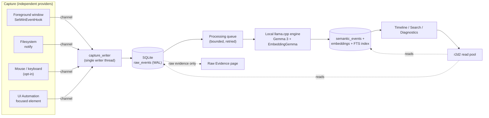
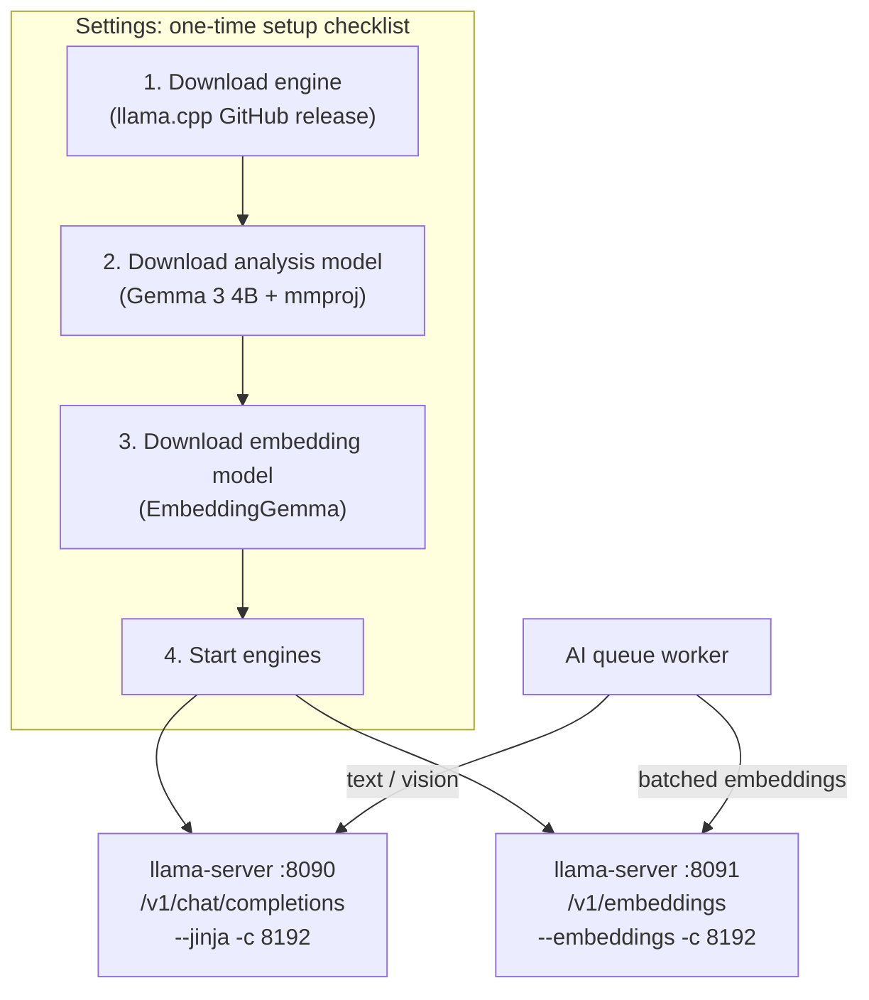

# Chronicle

Chronicle is a Windows-first, local-first computer memory engine. It watches your activity — foreground apps, window titles, filesystem changes, and (opt-in) mouse clicks, keyboard metadata, and screenshots — and persists it as raw evidence on your own machine before any AI touches it. A local LLM turns that evidence into searchable semantic insights; Timeline and Search show only the processed insights, never the raw capture stream.

Everything runs on-device. No cloud processing, no telemetry, no external service in the loop.

## Architecture

Capture and AI processing are decoupled — a slow or unavailable model never blocks persistence, and a busy database never stalls an input hook.



Raw events are append-only evidence. Semantic events reference their source raw event and can be regenerated when models change; deleting or reprocessing semantic data never touches the raw record it came from. Only context-bearing events — window/app focus changes and filesystem activity — are queued for AI analysis; mouse and keyboard activity is recorded for Raw Evidence but never reaches the model. Screenshots are captured once, at the moment a window gains focus, held in a small in-memory cache, and released after processing — never re-captured later, never written to disk.

### Local AI engine

Local inference runs on a bundled [llama.cpp](https://github.com/ggml-org/llama.cpp) `llama-server` — no separate install, tray icon, or Start Menu entry. Chronicle downloads it once and runs it as an ordinary child process.



Both servers speak llama.cpp's OpenAI-compatible API on `127.0.0.1`, overridable via `CHRONICLE_LLAMA_HOST` / `CHRONICLE_LLAMA_CHAT_PORT` / `CHRONICLE_LLAMA_EMBED_PORT`. Text analysis batches up to 8 events per request with an index-checked response (falling back to individual requests if a batch response is malformed); embeddings batch natively through `/v1/embeddings`'s array input. Each server is launched only if its files are present and it isn't already listening; Chronicle stops only the processes it started. Capture and persistence work fully with none of this set up — the AI queue simply retries until setup completes.

## Privacy

- Foreground, mouse/keyboard metadata, and screen capture are each independently opt-in; screen capture is off by default.
- Keyboard capture stores metadata only by default; text capture, where enabled, is restricted to an explicit per-application allowlist.
- Application/path exclusions match on exact executable name and path-component containment (not raw substring), applied before persistence.
- Watched folders record file metadata only, never file contents.
- Export produces local JSON; delete-all permanently removes raw, semantic, embedding, and queue records after confirmation.
- Diagnostics reports permissions, exclusions, storage, queue state, and provider availability.

## Performance

- Mouse capture is click/scroll only — movement is never recorded or analyzed.
- SQLite runs WAL with `synchronous=NORMAL`, indexed hot paths, and a `busy_timeout`.
- The AI worker batches, paces between batches, and steps aside while you're actively typing/clicking, so local inference doesn't compete with active use.
- The local engine client reuses keep-alive HTTP connections and bounds generation length (`max_tokens`) so one bad response can't stall the queue.
- `processing_metrics` (completed/failed/panicked counts, average latency) is queryable live, separate from raw queue counts.

## Known limitations

- GPU acceleration isn't automatic — the engine always downloads the CPU-only build.
- No model-swap/version-upgrade path; replacing a model means removing it and downloading a replacement by hand.
- Elevated apps, UAC/secure-desktop input, and antivirus interaction are untested.
- Raw-event search does not currently filter by query (see `Database::recent_events`).

## Development

```powershell
npm install
npm run build
npm test
npm run test:frontend
npm run tauri dev
```

`npm test` runs the Rust test suite (schema, ordering, FTS, retries, queue, end-to-end processing). `npm run test:frontend` type-checks the frontend. Capture workers auto-restart on launch if capture was previously enabled. The Tauri CLI and Windows WebView2 runtime are required for the desktop app.

Additional scripts:

| Script | Purpose |
| --- | --- |
| `scripts/release-smoke.ps1` | Frontend checks, Rust tests, production build, NSIS packaging, runtime startup check |
| `scripts/windows-runtime-smoke.ps1` | Runtime startup check only |
| `scripts/windows-capture-acceptance.ps1` | Launches Notepad and verifies foreground events reach SQLite (requires Python 3) |
| `scripts/benchmark.ps1` | Persistence, search, queue, and frontend timing baselines |

### Windows startup troubleshooting

If the Rust build succeeds but the app exits with `0xc0000139 (STATUS_ENTRYPOINT_NOT_FOUND)`, ensure `WebView2Loader.dll` and the generated `chronicle_lib.dll` are available in both `src-tauri/target/debug` and `src-tauri` when launching through Cargo, and that the WebView2 Runtime is installed.
